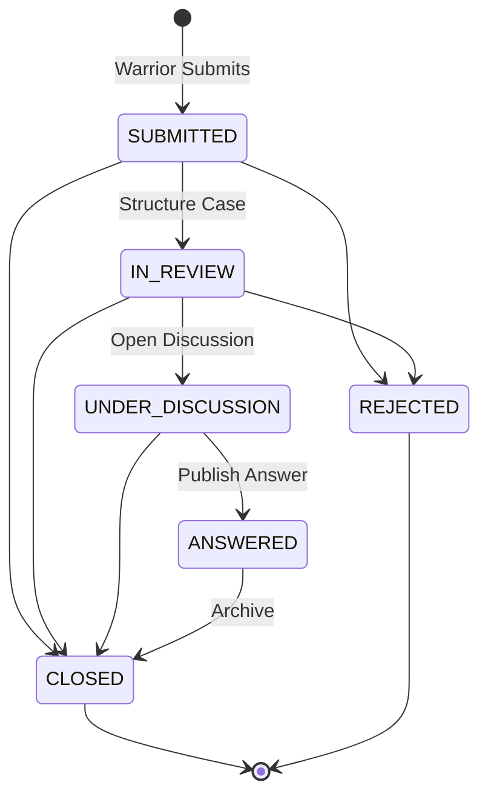
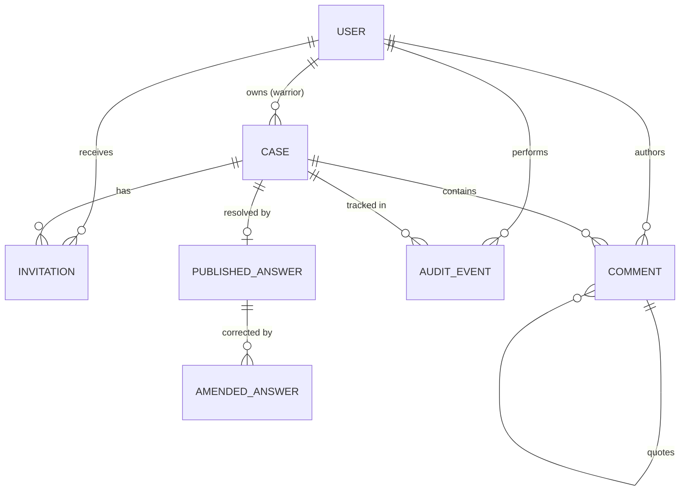

# Data Model: Virtual Tumor Board Backend

This document defines the entity models, state machine, and database relationships for the Virtual Tumor Board backend.

## 1. Entity Definitions

The project uses a 3-app structure: `accounts`, `cases`, and `audit`. All primary keys are UUIDs to prevent sequential inference.

### 1.1. accounts.User
Custom user model extending `AbstractUser`.
| Field | Type | Constraints | Description |
|-------|------|-------------|-------------|
| `id` | UUIDField | PK, default=uuid4 | |
| `role` | CharField | max_length=20, choices | Distinct personas: `warrior`, `doctor`, `moderator` |
| `username`, `email`, etc | Inherited | Inherited | Inherited from AbstractUser |

### 1.2. cases.Case
Core domain entity representing a patient's case lifecycle.
| Field | Type | Constraints | Description |
|-------|------|-------------|-------------|
| `id` | UUIDField | PK, default=uuid4 | |
| `title` | CharField | max_length=255 | |
| `status` | CharField | max_length=20, choices | Enum: SUBMITTED, IN_REVIEW, UNDER_DISCUSSION, ANSWERED, CLOSED, REJECTED. Defaults to SUBMITTED. |
| `version` | PositiveInt | default=1 | Optimistic locking field. |
| `warrior` | ForeignKey | to User, on_delete=PROTECT | The case owner. |
| `original_question` | TextField | | The Warrior's submitted question. |
| `structured_summary` | TextField | null=True, blank=True | Moderator-prepared clinical case. |
| `structured_by` | ForeignKey | to User, null=True, on_delete=SET_NULL | Who structured it. |
| `structured_at` | DateTimeField | null=True, blank=True | |
| `created_at` | DateTimeField | auto_now_add=True | |
| `updated_at` | DateTimeField | auto_now=True | Set explicitly in `.update()` calls. |

### 1.3. cases.Invitation
Manages Doctor access to specific cases. **Auto-accepted on creation** — the Moderator curates the panel, so there is no separate accept/decline workflow at assessment scale. The `status` field is retained for extensibility but defaults to `ACCEPTED`.
| Field | Type | Constraints | Description |
|-------|------|-------------|-------------|
| `id` | UUIDField | PK, default=uuid4 | |
| `case` | ForeignKey | to Case, on_delete=CASCADE | |
| `doctor` | ForeignKey | to User, on_delete=CASCADE | |
| `invited_by` | ForeignKey | to User, on_delete=PROTECT | |
| `status` | CharField | choices, default=ACCEPTED | ACCEPTED (auto-set on invite). Field kept for future accept/decline extensibility. |
| `created_at` | DateTimeField | auto_now_add=True | |

*Constraints*: `UniqueConstraint` on `(case, doctor)`.

*Scope cut*: Accept/decline flow deferred. At ~50 doctors, the Moderator directly invites known specialists. In production, add `POST /api/invitations/{id}/accept/` and `POST /api/invitations/{id}/decline/` with notification.

### 1.4. cases.Comment
Threaded discussion comments. Presentation anonymity is handled via snapshots and flags.
| Field | Type | Constraints | Description |
|-------|------|-------------|-------------|
| `id` | UUIDField | PK, default=uuid4 | |
| `case` | ForeignKey | to Case, on_delete=CASCADE | |
| `parent` | ForeignKey | to self, null=True, on_delete=CASCADE | Adjacency list for threading. |
| `author` | ForeignKey | to User, on_delete=PROTECT | True author always stored. |
| `content` | TextField | | |
| `is_anonymous` | BooleanField | default=False | Controls peer-facing visibility. |
| `anonymous_number` | PositiveInt | null=True, blank=True | Per-case sequential number (e.g., 1 for "Anonymous Doctor #1"). |
| `is_revealed` | BooleanField | default=False | True if identity was revealed after posting anonymously. |
| `parent_display_name_snapshot` | CharField | max_length=100, null=True, blank=True | Frozen display name of the parent comment's author at reply time. Prevents a parent's reveal from re-contextualizing downstream replies. |
| `quoted_comment` | ForeignKey | to self, null=True, on_delete=SET_NULL | The comment being quoted. |
| `quoted_text_snapshot` | TextField | null=True, blank=True | Frozen text at quote time. |
| `quoted_display_name_snapshot` | CharField | null=True, blank=True | Frozen attribution at quote time. |
| `created_at` | DateTimeField | auto_now_add=True | |
| `updated_at` | DateTimeField | auto_now=True | |

*Methods*: `get_display_name()` returns `Anonymous Doctor #N` if `is_anonymous` and not `is_revealed`, else author's real name.

*Reveal-after-publish rule*: Identity reveal (`POST /api/comments/{id}/reveal/`) is **allowed** even when `case.status == ANSWERED`. A reveal is a presentation-layer accountability action, not a clinical content edit. The immutability constraint protects discussion *content* (text body), not *attribution*. This is audited as `IDENTITY_REVEALED`.

### 1.5. cases.PublishedAnswer
The final verified answer published by a Moderator.
| Field | Type | Constraints | Description |
|-------|------|-------------|-------------|
| `id` | UUIDField | PK, default=uuid4 | |
| `case` | OneToOneField | to Case, on_delete=CASCADE | One answer per case. |
| `content` | TextField | | The verified answer. |
| `published_by` | ForeignKey | to User, on_delete=PROTECT | |
| `published_at` | DateTimeField | auto_now_add=True | |

### 1.6. cases.AmendedAnswer
Explicit versioned corrections to a PublishedAnswer.
| Field | Type | Constraints | Description |
|-------|------|-------------|-------------|
| `id` | UUIDField | PK, default=uuid4 | |
| `published_answer` | ForeignKey | to PublishedAnswer, on_delete=CASCADE | |
| `version_number` | PositiveInt | | Sequential amendment version (1, 2, 3...). |
| `content` | TextField | | The amended text. |
| `reason` | TextField | | Reason for the amendment. |
| `amended_by` | ForeignKey | to User, on_delete=PROTECT | |
| `created_at` | DateTimeField | auto_now_add=True | |

*Constraints*: `UniqueConstraint` on `(published_answer, version_number)`.

### 1.7. audit.AuditEvent
Append-only log of clinically meaningful writes.
| Field | Type | Constraints | Description |
|-------|------|-------------|-------------|
| `id` | UUIDField | PK, default=uuid4 | |
| `action` | CharField | max_length=30, choices | e.g. CASE_TRANSITION, DOCTOR_INVITED. |
| `actor` | ForeignKey | to User, on_delete=PROTECT | |
| `timestamp` | DateTimeField | auto_now_add=True, db_index=True | |
| `case` | ForeignKey | to Case, on_delete=PROTECT | Explicit FK for integrity. |
| `target_comment` | ForeignKey | to Comment, null=True, on_delete=SET_NULL | |
| `target_user` | ForeignKey | to User, null=True, on_delete=SET_NULL | e.g. the invited doctor. |
| `metadata` | JSONField | default=dict | Before/after state, version info. |

*Behavior*: Append-only. `save()` rejects updates, `delete()` raises error.

## 2. State Machine

The `Case` entity follows a strict lifecycle managed by `cases.services.py`. All service methods that change case state or create related records MUST be wrapped in `@transaction.atomic` to prevent partial writes.

### Valid Transitions
| From State | To State | Trigger / Action |
|------------|----------|------------------|
| SUBMITTED | IN_REVIEW | Moderator structures the case |
| IN_REVIEW | UNDER_DISCUSSION | Moderator opens discussion |
| UNDER_DISCUSSION | ANSWERED | Moderator publishes final answer |
| SUBMITTED | CLOSED | Moderator closes |
| SUBMITTED | REJECTED | Moderator rejects |
| IN_REVIEW | CLOSED | Moderator closes |
| IN_REVIEW | REJECTED | Moderator rejects |
| UNDER_DISCUSSION | CLOSED | Moderator closes |
| ANSWERED | CLOSED | Moderator archives/closes a resolved case |

**CLOSED** and **REJECTED** are terminal states — no transitions out of them.

*Invalid Examples*: SUBMITTED → ANSWERED, ANSWERED → UNDER_DISCUSSION, CLOSED → anything, REJECTED → anything.

### Implementation Notes

- **Transaction boundaries**: Multi-step operations (e.g., publish-answer = update Case status + create PublishedAnswer) MUST use `@transaction.atomic` so a crash between queries doesn't corrupt state.
- **Late-comment race condition**: Comment creation service MUST verify `case.status` is still in a commentable state (`UNDER_DISCUSSION`) inside a `transaction.atomic()` block, using `select_for_update()` on the Case row to prevent a comment from inserting after a concurrent transition to `ANSWERED` or `CLOSED`.
- **Model-level immutability**: `Comment.save()` override MUST raise an error if `self.case.status == 'ANSWERED'` and this is an update (not a new insert from reveal). `PublishedAnswer.save()` override MUST reject updates on existing records. This is defense-in-depth beyond the service layer.

## 3. Relationships Diagram

